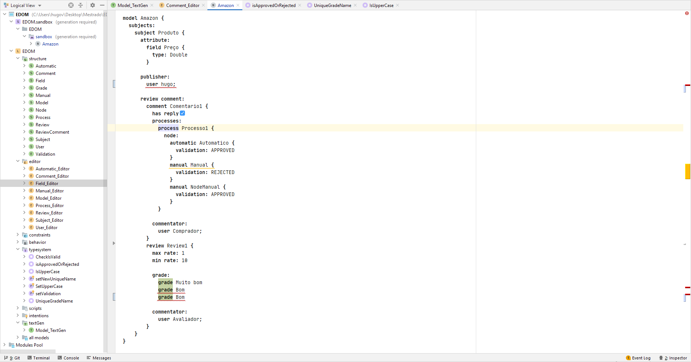

# EDOM Project, Part 1, Tool 1

## Description of the Tool

#### Meta Programming System (MPS) é uma uma ferramenta disponibilizada pela Jet Brains (https://www.jetbrains.com/). Esta tool é uma DSL (Domain Specific Language) que, como o próprio nome indica, permite a criação de uma linguagem de domínio específica, ao ser possível expressar todo o processo de domínio através do uso de conceitos e regras específicas.

## How to Setup and Install

#### Instalar através do URL https://www.jetbrains.com/mps/download/ (correr o instalador e seguir todos os passos do wizard). 

## Implementation of the Metamodel

#### Para a implementação do metamodelo utilizando o MPS, foi necessário criar todas as classes discutidas em grupo durante a construção do metamodelo. Neste caso, as classes são representadas por **concepts** e é através das mesmas que são criadas todas as ligações necessárias entre as diferentes classes.

#### Na seguinte imagem é possível perceber como funcionam este conceitos. Este é referente à classe **Subject** e implementa a interface **INamedConcept**, conferindo à mesma o atributo **Name** automaticamente. 

#### Para além deste, são associadas a esta classe: 
* 0 ou mais classes do tipo **Field**
* 1 ou mais classes do tipo **User**
* 0 ou mais classes do tipo **ReviewComment** 

## Implementation of Constraints and Refactorings

#### Relativamente à implementaçáo dos constrangimentos e das transformações foram encontradas três possíveis soluções:
* **Constraints** -> Permitem definir certos constrangimentos na linguagem implementada, mas, no entanto, não permitem a correção dos mesmos através de uma transformação.
* **Typesteams** -> Permitem definir erros ou avisos na linguagem implementada e, neste caso, já é possível apresentar transformações ao ser criado o modelo baseado na linguagem.
* **Intentions** -> Permitem definir avisos às regras definidas, assim como corrigir esses avisos. No entanto não permitem definir erros e os modelos criados, e assim é possível criar modelos com erros. 

#### Tendo em conta as duas opções referidas acima, foram utilizadas as **Typesteams** para a criação de todos os constrangimentos e transformações requisitadas:
* 1 - Verificar se o nome do autor é iniciado por letra maiúscula.
* 2 - Verificar que o nome das avaliações é único.
* 3 - Permitir que o processo de avaliação tenha apenas dois *outcomes* possíveis.

#### Para a realização destes 3 constrangimentos foi criada, para cada um, na componente das **typesteams**, uma **Checking Rule** e um **Quick Fix** responsáveis pela criação da regra a ser seguida pelo modelo e pela transformação associada ao mesmo, respetivamente.

| Constrangimento   |       Checking Rule        | Quick Fix |
|:-:|:---------------------------:|:-------------------------:|
| 1 |  |  |
| 2 |  |  |
| 3 |  |  |

#### Para além destes 3 constragimentos, foram também criados outros mais simples que resultaram de discussões realizadas entre o grupo ao longo do desenvolvimento do projeto. Para estas foram utilizadas as **Constraints** visto não serem necessárias transformações para as mesmas. Posto isto, foram criados os seguintes constragimentos:
* Verificar se o **minRate** é inferior ao **maxRate** nas **Reviews** e se estes são sempre valores positivos.
* Apenas permitir na validação dos **Nodes** que sejam aceites os valores *APPROVED* e *REJECTED*.

## Implementation of the Visualizations

#### No que toca à implementação das visualizações, os diagramas são capazes de representar graficamente os modelos criados através de um ficheiro textual **PlantUML**. Para tal, foi utilizada a componente **textGen** do MPS, que associada à class root do projeto (Model), gera todo o texto associado ao **PlantUML** através de código desenvovlvido em **Java**.
 
#### Na imagem seguinte é possível perceber como foi criada a função de geração das visualizações e parte do código associado à mesma.

## Implementation of Models (instances)

#### Relativamente à implementação dos modelos, visto que o MPS não dispõe de uma ferramenta *default* que permita a criação/visualização das instâncias do modelo, foi necessário criar para cada uma das classes um **Concept Editor** que permita a instanciaçáo das mesmas. O **editor** é mais uma das componentes disponibilizadas pelo MPS que permite definir como cada uma das classes/conceitos são instanciados.

#### Na seguinte imagem são apresentados alguns dos **Concept editors** criados

#### De forma a tornar mais claro como são criados estes **Concept Editors**, é também apresentada de seguida uma imagem que exemplifica a criação de um **Concept Editor** relativo aos **Comentários**.

#### Neste caso é permitido ao utilizador instanciar o nome do comentário, assim como indicar através de uma **checkbox** se o mesmo tem respostas ou não, criar novos processos de validação e ainda referenciar o nome do utilizador que irá realizar o mesmo.

#### Para concluir esta secção, é apresentado na imagem seguinte um exemplo de um modelo criado a partir do metamodelo definido através dos **Concepts** e dos respetivos  **Concept Editors**

## Execution of Constraints and Refactorings

#### Relativamente à execução das **Constraints** e **Refactorings**, esta terá por base o modelo apresentado na imagem seguinte.

#### São de seguida apresentadas as mensagens de erro e as transformações associadas às mesmas.

| Constrangimento/Transformação | Erro/Aviso | Tooltip de ajuda | Transformação | 
|:-:|:-:|:-:|:-:|
| 1 |  |  |  |
| 2 |  |  |  |
| 3 |  |  |  |

## Generation/Execution of Visualizations

#### Quanto à visualização dos modelos, na seguinte imagem é possível verificar o diagrama **PlantUML** gerado a partido do modelo apresentado na imagem da secção **Implementation of Models**

## Referências

* https://www.jetbrains.com/mps/
* https://dev.to/antoine/creating-a-simple-language-using-jetbrains-mps-c7d
* https://www.jetbrains.com/mps/learn/
