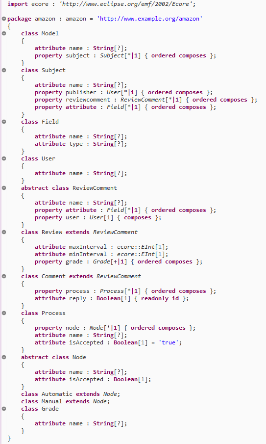
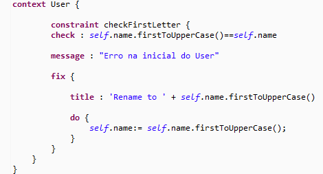
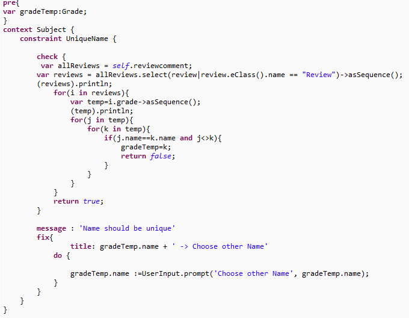
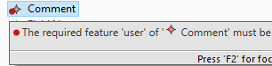
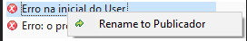
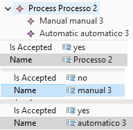
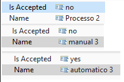
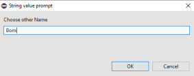

# EDOM Project, Part 1, Tool 3

## Descrição da ferramenta
Epsilon é uma família de linguagens de script baseadas em Java para automatizar tarefas comuns de engenharia de software baseadas em modelo, como geração de código, transformação de modelo para modelo e validação de modelo, que funcionam prontamente com EMF (incluindo Xtext e Sirius ), UML, Simulink, XML e outros tipos de modelos. Epsilon também inclui editores e depuradores baseados em Eclipse, ferramentas reflexivas convenientes para modelagem textual e visualização de modelo e tarefas do Apache Ant.

## Como instalar e configurar

###Alternativa 1
* Caso ainda não tiver *Eclipse Installer*, aceder este link *https://www.eclipse.org/epsilon/download/* escolher o sistema operativo na qual deseja instalar, e fazer o download.
* Após o download, abrir o *Eclipse Installer* e procurar por *Epsilon*.
* Fazer a instalação e aceitar os termos de uso.

###Alternativa 2
* Abrir o eclipse IDE.
* Através do botão *help* que se encontra na barra de feramentas, aceder a opção *Eclipse Marketplace*.
* Na barra de pesquisa, procurar por *Epsilon* e instalar.
* Instalar apenas as funcionalidades predefinidas e aceitar os termos apresentados.
* Se tudo correr bem, a instalação é concluida com sucesso.

## Implementação do metamodelo
Para a implementação do metamodelo em Epsilon, foi utilizado a mesma tecnica usada em eclipse para a criação de metamodelos. Usou-se um *ecore modeling project* e através de uma interface gráfica foi criado o metamodelo discutido juntamente com os colegas de grupo. Algumas classes foram representadas como abstratas como por exemplo no caso da *ReviewComment* que contém dados da classe *Review* e *Comment*. 
A representação gráfica do metamodelo se encontra no [readme](../readme.md) e a seguir será apresentado o código do metamodelo.

## Implementação de restrições e Refatorações
Para aplicar as restrições propostas, algumas foram feitas através das cardinalidades no metamodelo, e outras feitas através do EVL (Epsilon Validation Language).

* O comentário ter apenas um utilizador associado.
Para satisfazer essa condição, usou-se a cardinalidade "1 para 1" para impor essa regra da tabela *User* para *ReviewComment*.

* As restrições a seguir apresentadas foram feitas todas no EVL, onde o *context* representa a classe onde é aplicada a regra, o *check* é onde ser aplica a regra/restrição, a *message* é a mensagem apresentada caso o *check* se verifica, e por fim a sintaxe *fix* que é aonde se faz as transformações das restrições, mais precisamente na parte da sitaxe *do*.

 | Restrições   |       Validação e transformação        |
|:-:|:---------------------------:|
| O nome do utilizador tem que começar com uma letra maiuscula. |  |
| O porcesso de validação dos comentarios tem que ter apenas duas saidas, no caso APPROVE ou REJECT representado respetivamente por *yes* e *no*. |  |
| Verificar que uma grade é unico dentro de uma avaliação. |  |

## Implementação das visualizações
* Para a visualizacação dos modelos, através do ficheiro .genmodel foi gerado o código Java relativo ao metamodelo.
* Através do método *main* criado na classe "GeneratPlantUml" foi desenvolvido um código capaz de gerar um ficheiro PlantUml. O método parametriza os diferentes campos e valores associados, as ligações e tipos de variaveis existentes, etc

***

	public static void main(String[] args) {
		// TODO Auto-generated method stub
		
				Resource.Factory.Registry.INSTANCE.getExtensionToFactoryMap().put("xmi", new XMIResourceFactoryImpl());
				
				// Initialize the model
				AmazonFactory.eINSTANCE.eClass();
				
				// Retrieve the default factory singleton
				AmazonFactory factory = AmazonFactory.eINSTANCE;

				// Obtain a new resource set
				ResourceSet resSet = new ResourceSetImpl();

				Resource resource = resSet.getResource(URI.createURI("model/Model.xmi"), true);
				
				PrintWriter writer=null;
				try {
					// now load the content.
					resource.load(Collections.EMPTY_MAP);

					// Get the root element
					EObject root = resource.getContents().get(0);
					Model myModel=(Model)root;
					
					System.out.println(root.toString());
					
					//-----
					// Generate a plantuml file that represents the use case model in a UML diagram
					FileWriter w = new FileWriter("instances/diagrama.puml");
			        writer = new PrintWriter(w);
			        
			        writer.println("@startuml");

			        for (Subject s: myModel.getSubject()) {
						writer.println(myModel.getName() + " --> " + s.getName() + " : subject");
						for (Field f: s.getAttribute()) {
							writer.println(s.getName() + " --> " + f.getName() + " : field ");
							writer.println("class " + f.getName() + " { \n" + f.getType() + "\n}");
						}
						for (User u: s.getPublisher()) {
							writer.println(s.getName() + " --> " + u.getName() + " : user ");
						}
						for (ReviewComment c : s.getReviewcomment()) {
							if (c instanceof Comment) {
								writer.println(s.getName() + " --> " + c.getName() + " : comment ");
								writer.println(c.getName() + " --> " + c.getUser() + " : user ");
								writer.println("class " + c.getName() + "{ \n " + ((Comment) c).isReply() + " \n");
								for (Process p : ((Comment) c).getProcess()) {
									writer.println(c.getName() + " --> " + p.isIsAccepted() + " : process");
									for (Node n : p.getNode()) {
										writer.println(p.isIsAccepted() + " --> " + n.getName() + " : node");
									}
								}
							}
						}
						for (ReviewComment r : s.getReviewcomment()) {
							if (r instanceof Review) {
								writer.println(s.getName() + " --> " + r.getName() + " : review");
								writer.println(r.getName() + " --> " + r.getUser() + " : user");
								writer.println("class " + r.getName() + " {");
								writer.println(((Review) r).getMaxInterval());
								writer.println(((Review) r).getMinInterval() + "\n }");
								for(Grade g:((Review) r).getGrade()) {
									writer.println(r.getName() + " --> " + g.getName() + " : grade");
								}
							}
							
							}
						}
					
			        
					//resource.save(Collections.EMPTY_MAP);
			        writer.println("@enduml");		
			        writer.close();

				} catch (IOException e) {
					// TODO Auto-generated catch block
					e.printStackTrace();
				}
				finally {
					writer.close();
				}

			}
***

## Implementação dos modelos (instâncias)

## Execução de restrições e Refatorações
 * Para a validação da existência de um utilizador num comentario ou numa review.
 

|Restrições|Inicial|Erro|Final|
|:-:|:-:|:-:|:-:|
| O nome do utilizador tem que começar com uma letra maiuscula. |  |||
| O porcesso de validação dos comentarios tem que ter apenas duas saidas, no caso APPROVE ou REJECT representado respetivamente por *yes* e *no*. |  |||
| Verificar que uma grade é unico dentro de uma avaliação. |  | ||

## Geração/Execução de vizualizações

Não foi possível gerar a visualização do PlantUml isto porque ao tentar executar o método criado, é lançada um erro apresentado a baixo. 
 
 	Error: Could not find or load main class Amazon.main.GeneratPlantUml
    
## Referências

* https://www.eclipse.org/epsilon/download/
* https://www.eclipse.org/epsilon/doc/evl/
* https://pure.york.ac.uk/portal/files/21653401/EpsilonBook.pdf
