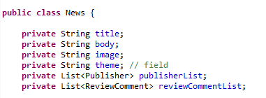

# EDOM Project, Part 2 - Team Report

## Design Concrete Syntax for the DSL
 O metamodelo sofreu uma pequena alteração em relação a primeira parte do projeto. Algumas alterações foram sugeridas pelo professor.
 As alterações feitas são:
* Foi removido o atributo *isAccepted* da classe *Process*.
* Adição de classes Enum para a classe *Field* mais precisamente para o atributo *FieldType* e para a classe *Node* para o atributo *isAccepted*.
	* A classe *Filed* contém valores: String, Boolean e Integer.
	* A classe *isAccepted* contém valores: Accepted e Rejected.

### Textual

Relativamente ao design da representação textual de cada elemento do metamodelo foi utilizada uma representação num formato semelhante a JSON que evidencia a sintaxe a implementar para a DSL. Na seguinte pasta estão apresentados todos os elementos criados: [Sintaxe textual](https://bitbucket.org/mei-isep/edom-20-21-team-403/src/master/part2/syntax-design/textual/)

### Gráfica

* Ferramenta MS 

|Elementos|Cor|Forma (somente no MS Tool para incrementar além da cor)|
|:-:|:-:|:-:|
|Model|Azul|Não tem|
|Subject|Verde|Oval|
|Field|Amarelo|Retângulo com cantos retos|
|User|Azul claro|Circular|
|ReviewComment|Roxo|Retângulo com cantos arredondados e borda tracejada|
|Review |Rosa|Retângulo com cantos arredondados|
|Comment|Rosa|Retângulo com cantos arredondados|
|Process|Vermelho|Retângulo com cantos arredondados|
|Node|Amarelo|Retângulo com cantos arredondados e borda tracejada|
|Automatic|Amarelo escuro|Retângulo com cantos arredondados|
|Manual|Amarelo escuro|Retângulo com cantos arredondados|

* Ferramenta Epsilon
 


## Specify Common Features for Applications of the Domain

 * Linguagem de desenvolvimento é Java.
 * Programação orientada a objeto (OO).
 * Usar o padrão factory como representação da BD.
 * A Base de dados será em memória.
 * A aplicação é feita em uma consola.
 * Usar o bootstrap para injetar dados.

## Implement Prototypes of Applications of the Domain
* [Publico](https://bitbucket.org/mei-isep/edom-20-21-team-403/src/master/part2/tool1-mps/Prototype/)
* [Amazon](https://bitbucket.org/mei-isep/edom-20-21-team-403/src/master/part2/tool3-epsilon/Workspace/Prototipo/)


## Identify Commonality and Variability in the Code

 |Partes em comum|
 |-|
 |Classes abstratas|
 |Atributos comuns de todos os prototipos. Estas atributos são predefinidos na geração do código que não dependem do modelo. Na figura abaixo temos o exemplo de um *Subject* instanciado como *News* para o caso do **Publico**, onde os atributos *title*, *body* e *image* vão ser genéricos para qualquer domínio.|



  |Partes diferentes|Relacionamento com o metamodelo|
 |-|-|
 |O publico não contém uma review.| O metamodelo tem uma classe abstrata *ReviewComment* que permite criar uma classe *Comment* ou/e *Review*.|
 |Os nomes das classes dependem do modelo.|No metamodelo existe um atributo *name* nas classes que permite definir o nome das classes geradas.|
 |As fields dependem do modelo.|No metamodelo foi criada a classe *Field* que permite definir atributos personalizados para as classes que estão associadas à mesma.|
 |No Gorgeous Sandwich não é necessária a validação de um comentário.| No modelo não é implementado o processo de validação.|


## Design and Implement Code Generation

Foi criada uma classe genérica que ilustra como se gera uma classe. Os valores que se encontram dentro dos parênteses retos [], são valores que dependem do modelo desenvolvido. Essas regras são aplicadas para todas as outras classes.

``` java
    package [PackgeName];


public class [ClassName] {

[for(temp in Attribute){]
	private [temp.AttributeType] [temp.AttributeName];
[}]
	private String genericAttribute;
	
	public [ClassName]([for(temp in Attribute){][temp.AttributeType] [temp.AttributeName],[}]String genericAttribute) {
	[for(temp in Attribute){]
		this.[temp.AttributeName]=[temp.AttributeName];
[}]
		this.genericAttribute=genericAttribute;
	}

	[for(temp in Attribute){]
	public [temp.AttributeType] get[temp.AttributeName.firstToUpperCase()](){
	return [temp.AttributeName];
	}
	
	public void set[temp.AttributeName.firstToUpperCase()]([temp.AttributeType] [temp.AttributeName]){
	this.[temp.AttributeName]=[temp.AttributeName];
	}
	
[}]
	public String getGenericAttribute(){
	return this.genericAttribute;
	}
	
	public void setGenericAttribute(String genericAttribute){
	 this.genericAttribute=genericAttribute;
	}
	@Override
	public String toString() {
		return "[u.name] [[for(temp in Attribute){] [temp.AttributeName]="+ [temp.AttributeName] +"[}] genericAttribute="+ genericAttribute+"]";
	}
}
```

## Generate Applications

Relativamente aos possíveis problemas encontrados ao serem realizados testes na geração das aplicações, foram destacados os seguintes:

 * **Bootstrap**. A instanciação de todas as classes necessárias para iniciar a aplicação poderá causar problemas caso as os objetos não sejam corretamente instanciados.

 * Erros de sintaxe devido a nomes ou falhas na DSL. 