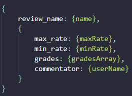
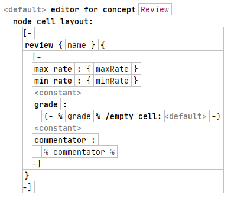
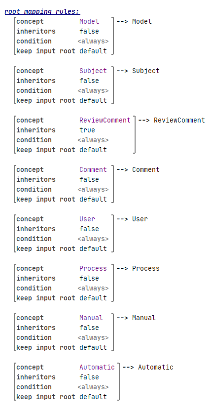
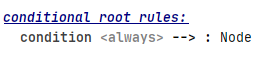
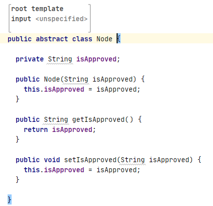
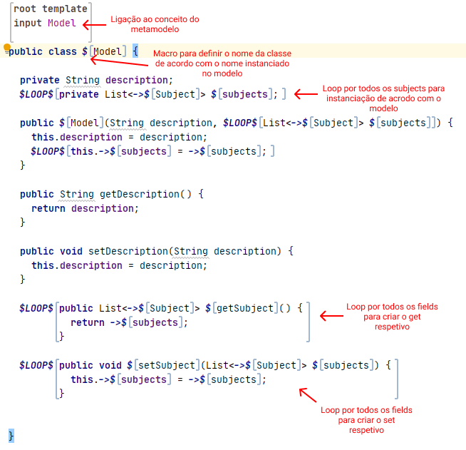
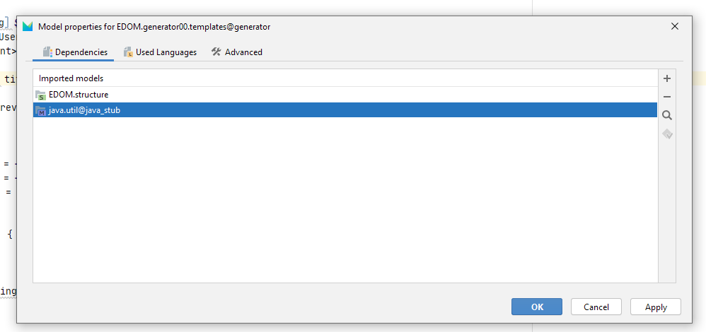

# EDOM Project, Part 3, MPS

## Activity 1: Design Concrete Syntax for the DSL

Relativamente à implementação das notações apresentadas no relatório de grupo, foi utilizado o **Editor** do MPS para realizar as mesmas. Estas podem ser encontradas no projeto desenvolvido [aqui](https://bitbucket.org/mei-isep/edom-20-21-team-403/src/master/part2/tool1-mps/EDOM/), no diretório do Editor.
Tendo em conta os constrangimentos e a formatação a seguir pela ferramenta, foram criados os respetivos editores a partir do design criado originalmente, dentro das limitações do MPS. Na tabela seguinte é possivel analisar as semalhanças entre o design e a formatação obtida utilizando o Editor para a classe *Review*.

Design         |  MPS
:-------------------------:|:-------------------------:
  |  

## Activity 5: Design and Implement Code Generation

Para a implementação da geração de código utilizando o MPS, foi utilizada uma das duas opções fornecidas pela ferramenta, o **Generator**. Esta decisão deveu-se ao facto de ser decidido em grupo que o prótipo seria criado na linguagem Java, linguagem a qual é suportada pelo *Generator*.

Posto isto, para cada conceito criado no metamodelo foi criada uma classe associada ao mesmo no *Generator*, de forma a "informar" a ferramenta como cada conceito deve ser representado quando o código é gerado para classes em Java. Na imagem abaixo é possível verificar este mapeamento, realizado a partir do *main* ( ficheiro de configuração do *Generator* ). 

No entanto, determinadas classes geradas não necessitam de ser mapeadas por serem consideradas estáticas entre as diferentes aplicações de domínio apresentadas e portanto não necessitam de estar associadas a nenhum conceito do metamodelo em específico. Temos nas imagens abaixo o exemplo da classe abstrata *Node* que verifica a condição referida, na primeira dentro do ficheiro *main* onde é indicado que deve ser sempre gerada e na segunda a classe estática associada a ser gerada.

Quanto às classes dependentes do modelo instanciado, apresentadas na primeira imagem desta secção, estas apresentam um conjunto de regras e *macros* a serem seguidas quando o código é gerado. Na imagem apresentada de seguida é demonstrado um exemplo de uma dessas classes geradas, com as respetivas *macros* associadas a cada um dos atributos variáveis que dependem do modelo criado. A partir das mesmas é possível referenciar as propriedades dos conceitos mapeados, fazer *loops* pelos atributos que podem conter mais do que um elemento e definir como esses mesmos conceitos são apresentados quando o código é finalmente gerado.

Para a utilização de objetos do tipo *List* foi também necessário importar o *package* "java.util@java_stub".

## Activity 6: Generate Applications

Quando aos problemas encontrados relativamente ao código gerado, no caso desta ferramenta não foi possível correr a aplicação no próprio MPS. No entanto, as classes geradas a partir do modelo podem ser copiadas para um IDE à escolha e correr a aplicação a partir do mesmo. Quando ao possíveis problemas, estes assemelham-se com os identificados no relatório de grupo:

 * **Bootstrap**. A instanciação de todas as classes necessárias para para iniciar a aplicação poderá causar problemas caso as os objetos não sejam corretamente instanciados.

 * Erros de sintaxe devido a nomes ou falhas na DSL. 

Concluindo todas as atividades, de um modo geral é possível afirmar que o MPS fornece uma grande fonte de ferramentas com as quais é possível criar DSLs muito genéricas, assim como outras mais especificas, direcionadas a um determinado negócio e a partir das mesmas gerar código correspondente aos modelos instanciados. No entanto, por esta ser uma ferramente pouco utilizada, a falta de documentação e de uma "comunidade" ativa, que muitas vezes auxilia na resolução de problemas, levou a que o trabalho realizado fosse dificultado e acrescido.
