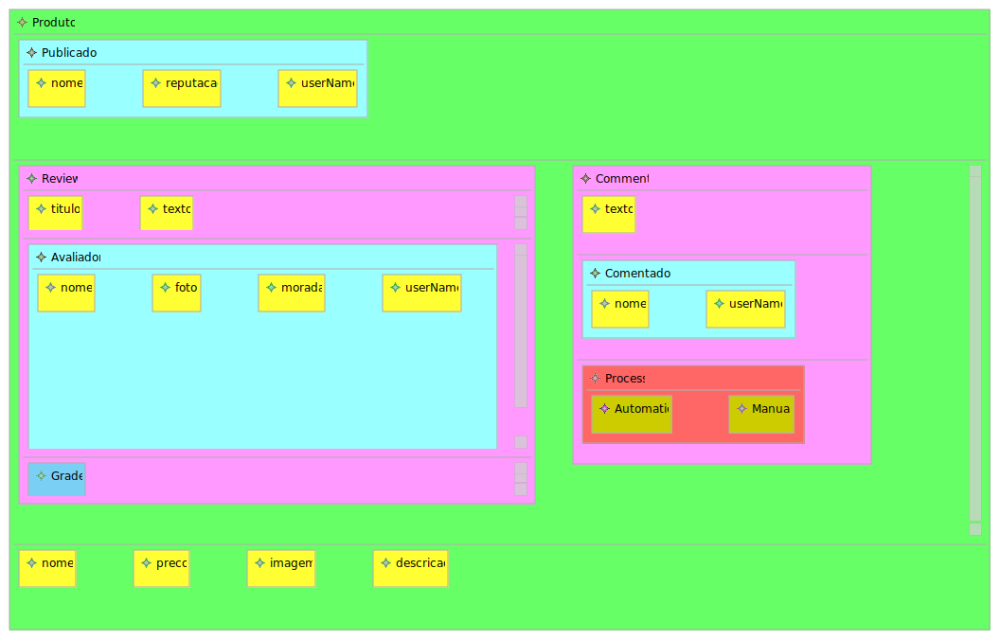

# EDOM Project, Part 2, Tool 3


## Activity 1-Design Concrete Syntax for the DSL

A ferramenta Epsilon suporta a notação gráfica. O resultado usando Eugenia foi o seguinte:

Amazon


O modelo da Amazon utiliza todas as componentes apresentadas no metamodelo.

Para implementar este gráfico usando Eugenia, começou-se a criar um ficheiro EMF a partir do modelo ecore. No ficheiro EMF é onde foi adicionadas todas as anotações necessárias para implementar o gráfico.
````
@"http://www.eclipse.org/OCL/Import"(ecore="http://www.eclipse.org/emf/2002/Ecore")
@gmf
@namespace(uri="http://www.example.org/amazon", prefix="amazon")
package amazon;

@gmf.diagram
@gmf.node(label="name", color="122,207,245", figure="rectangle")
class Model {
	attr String name;

	@gmf.compartment
	val Subject[*] subject;
}

@gmf.node(label="name", color="102,255,102", figure="rectangle")
class Subject {
	attr String name;

	@gmf.compartment
	val User[*] publisher;

	@gmf.compartment
	val ReviewComment[*] reviewcomment;

	@gmf.compartment
	val Field[*] attribute;
}

@gmf.node(label="name", color="255,255,51", figure="rectangle")
class Field {
	attr String name;
	attr FieldType type;
}

@gmf.node(label="name", color="153,255,255", figure="rectangle")
class User {
	attr String name;

	@gmf.compartment
	val Field[*] field;
}

@gmf.node(label="name", color="204,153,255", figure="rectangle")
abstract class ReviewComment {
	attr String name;

	@gmf.compartment
	val Field[*] attribute;

	@gmf.compartment
	val User[1] user;
}

@gmf.node(label="name", color="255,153,255", figure="rectangle")
class Review extends ReviewComment {
	attr int[1] maxInterval;
	attr int[1] minInterval;

	@gmf.compartment
	val Grade[+] grade;
}

@gmf.node(label="name", color="255,153,255", figure="rectangle")
class Comment extends ReviewComment {

	@gmf.compartment
	val Process[*] process;
	readonly id attr boolean[1] reply;
}

@gmf.node(label="name", color="255,102,102", figure="rectangle")
class Process {

	@gmf.compartment
	val Node[*] node;
	attr String name;
}

@gmf.node(label="name", color="255,255,0", figure="rectangle")
abstract class Node {
	attr String name;
	attr IsAccepted isAccepted;
}

@gmf.node(label="name", color="204,204,0", figure="rectangle")
class Automatic extends Node {
}

@gmf.node(label="name", color="204,204,0", figure="rectangle")
class Manual extends Node {
}

@gmf.node(label="name", color="122,207,245", figure="rectangle")
class Grade {
	attr String name;
}

@gmf.node(label="name")
enum IsAccepted {
	Accepted = 0;
	Rejected = 1;
}

@gmf.node(label="name")
enum FieldType {
	String = 0;
	Boolean = 1;
	Integer = 2;
}


````

Acima está o ficheiro EMF gerado com as anotações necessárias. É necessário referir a anotação * @ gmf * logo no início do ficheiro.
Em seguida foi necessário colocar a anotação *@gmf.diagram* na Classe do elemento raiz do metamodelo, nesse caso é o *Model*.
Depois para cada classe foi necessário adicionar a anotação *@gmf.node (label = "name", color = "122,207,245", figure = "rectangle") * que indica que existe um nó. É possível personalizar a cor e o tipo de figura correspondentes. Nesse caso, para o tipo de figura foi utilizado apenas a retângulo, e os elementos deferenciam-se entre eles atraves das cores dos retângulos.

Também foi necessário adicionar *@gmf.compartment* a todos os *val* em cada classe existente.
Após todos esses passos, basta fazer com o botão direito no ficheiro EMF, ir na opção Eugenia, e gerar os ficheiros através da opção * Generator GMF Editor*.
Em seguida, é necessário criar uma nova configuração de eclipse do tipo *Eclipse Application*.
Depois disso, uma nova janela do Eclipse será aberta e é necessário criar um novo aplicativo Java. Em seguida, criamos um novo ficheiro do tipo do diagrama que foi feito no projeto, no caso é *amazon*. Em seguida, a notação gráfica é criada, podendo criar os dados graficamente no ficheiro *.Amazon_diagram* ou no *.Amazom* que tem a mesma estrutura que o XMI.

## Activity 6- Design and Implement Code Generation / Generate applications

No aplicativo Epsilon, há uma linguagem específica para geração de código * EGL * (Epsilon Generation Language)
A sintaxe desta linguagem é como o exemplo abaixo:

````

package [%=package%].[%=subpack%];


public class [%=u.name%] {

[%for(temp in u.field){%]
	private [%=temp.type%] [%=temp.name%];
[%}%]
	private String userName;
	
	public [%=u.name%]([%for(temp in u.field){%][%=temp.type%] [%=temp.name%],[%}%]String userName) {
	[%for(temp in u.field){%]
		this.[%=temp.name%]=[%=temp.name%];
[%}%]
		this.userName=userName;
	}

	[%for(temp in u.field){%]
	public [%=temp.type%] get[%=temp.name.firstToUpperCase()%](){
	return [%=temp.name%];
	}
	
	public void set[%=temp.name.firstToUpperCase()%]([%=temp.type%] [%=temp.name%]){
	this.[%=temp.name%]=[%=temp.name%];
	}
	
[%}%]
	public String getUserName(){
	return this.userName;
	}
	
	public void setUserName(String userName){
	 this.userName=userName;
	}
	@Override
	public String toString() {
		return "[%for(temp in u.field){%]\n[%=temp.name.firstToUpperCase%]:"+ [%=temp.name%] +"[%}%]\nUserName:"+ userName+"\n";
	}
}


````

Este exemplo é da classe *user*. Uma vez que todos os *users* terão um *userName*, ele é escrito diretamente no ficheiro. Mas todas as outras coisas como o nome da classe, atributos, etc, dependem das instâncias do metamodelo, todos eles devem estar entre parênteses retos para que o arquivo * EGL * saiba que eles são relativos ao XMI.
Este exemplo serve como um modelo para a classe de *users*.
Também é necessário criar um arquivo * EGX *. Este arquivo é responsável por coordenar as múltiplas regras baseadas em templates.
O ficheiro * EGX * se parece com o seguinte:

````

rule User2Class
	transform u : User {
	
	template : "Utilizador2class.egl"
	
	parameters : Map {"package" = package,"subpack"=packageModel}
	
	target : package +"/"+packageModel+ "/"+u.name+".java"
	
}

````

Para as classes como o *SFactory* que são constantes, o *EGX* sofre uma pequena alteração, onde não se coloca a sintaxe *transform*. O exemplo a baixo ilustra a diferença.

````
package [%=package%].[%=subpack%];

public class SFactory {

	private static Factory factory=null;
		
	public static void setInstance(Factory f) {
		factory=f;
	}
			
	public static Factory getInstance() {
		if (factory==null) {
			factory=new FactoryImpl();
		}
		return factory;
	}
			
}
````
````

rule SFactory2Class{
	
	template : "sfactory2class.egl"
	
	parameters : Map {"package" = package,"subpack"=packageFactory}
	
	target : package +"/"+packageFactory+  "/SFactory.java"
	
}

````

É de mencionar que no ficheiro * EGX *, são referidos todos os arquivos * EGL * existentes que se pretende gerar um determinado código. Neste tipo de ficheiro, são referenciados o template, o nome da *package*, a pasta e o ficheiro de saída.

Os problemas encontrados foram os mesmos mencionados no relatório da equipe. O bootstrap é impossível de implementar por causa das partes variáveis do modelo e, às vezes, há algum tipo de erro de sintaxe que está fora do controle da DSL.